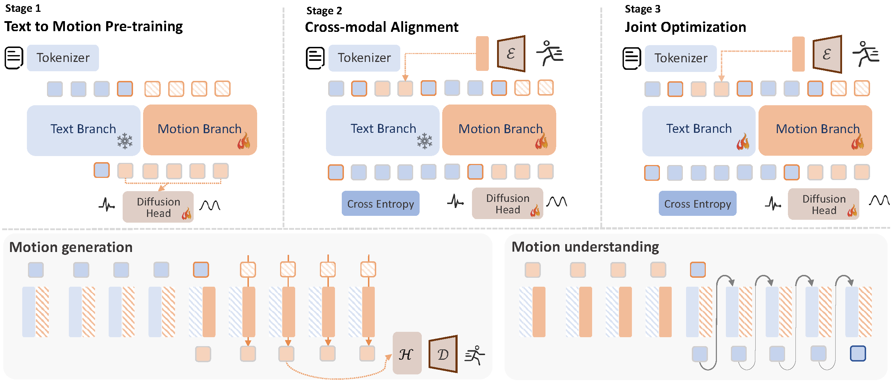

<div align= "center">
    <h1> Official repo for MotionGPT3 </h1>

</div>

<div align="center">
    <h2> <a href="https://motiongpt3.github.io">MotionGPT3: Human Motion as a Second Modality</a></h2>

<p align="center">
  <a href="https://motiongpt3.github.io">Project Page</a> •
  <a href="https://arxiv.org/abs/2506.24086 ">Arxiv Paper</a> •
  <a href="#-citation">Citation
</p>

</div>

<div align="center">

</div>


## 🏃 Intro MotionGPT3

MotionGPT3 is a **bimodal** motion-language framework using MoT architecture designed to address the challenges of **unified** motion understanding and generation.

<details open>
    <summary><b>Technical details</b></summary>

<p style="margin-bottom: 4px;">
Inspired by the mixture of experts, we propose MotionGPT3, a bimodal motion-language model that treats human motion as a second modality, decoupling motion modeling via separate model parameters and enabling both effective cross-modal interaction and efficient multimodal scaling training. 
</p>
<p style="margin-bottom: 4px;">
To preserve language intelligence, the text branch remains the same with the pretrained language model, while a motion branch is integrated via shared attention, enabling bidirectional information flow between two modalities. We employ a motion VAE to encode raw human motion into latent representations, while motion branch predicts motion latents directly from intermediate hidden states using a diffusion head, bypassing discrete tokenization. 
</p>
<p>
Extensive experiments show that our approach achieves competitive performance on both motion understanding and generation tasks while preserving strong language capabilities, establishing a unified bimodal motion diffusion framework within an autoregressive manner.
</p>


</details>

## 🚩 News

- [2025/06/30] Upload and init project

## ⚡ Quick Start

<details open>
  <summary><b>Setup and download</b></summary>

### 1. Conda environment

```
conda create python=3.11 --name mgpt
conda activate mgpt
```

Install the packages in `requirements.txt` and install [PyTorch 2.0](https://pytorch.org/)

```
pip install -r requirements.txt
python -m spacy download en_core_web_sm
```

We test our code on Python 3.11.11 and PyTorch 2.0.0.

### 2. Dependencies

Run the script to download dependencies materials:

```
bash prepare/download_smpl_model.sh
bash prepare/prepare_gpt2.sh
```

For Text to Motion Evaluation

```
bash prepare/download_t2m_evaluators.sh
```

For pre-trained MotionVAE:

```
bash prepare/download_mld_pretrained_models.sh
```

<!-- ### 3. Pre-trained model

Run the script to download the pre-trained model

```
bash prepare/download_pretrained_models.sh
```

### 4. (Optional) Download manually

Visit [the Google Driver](https://drive.google.com/drive/folders/xxx) to download the previous dependencies.

Visit [the Hugging Face](https://XXXXXX) to download the pretrained models. -->

</details>

## ▶️ Demo

<details open>
  <summary><b>Webui</b></summary>

Run the following script to launch webui, then visit [0.0.0.0:8888](http://0.0.0.0:8888)

```
python app.py
```

</details>

<details open>
  <summary><b>Batch demo</b></summary>

We support txt file input, the output motions are npy files and output texts are txt files. Please check the `configs/assets.yaml` for path config, TEST.FOLDER as output folder.

Then, run the following script:

```
python demo.py --cfg ./configs/MoT_vae_stage3.yaml --example ./demos/t2m.txt
```

Some parameters:

- `--example=./demo/t2m.txt`: input file as text prompts
- `--task=t2m`: evaluation tasks including t2m, m2t, pred, inbetween

The outputs:

- `npy file`: the generated motions with the shape of (nframe, 22, 3)
- `txt file`: the input text prompt or text output
</details>

## 💻 Train your own models

<details open>
  <summary><b>Training guidance</b></summary>

### 1. Prepare the datasets

1. Please refer to [HumanML3D](https://github.com/EricGuo5513/HumanML3D) for text-to-motion dataset setup.

2. Put the instructions data in `prepare/instructions` to the same folder of HumanML3D dataset.

4. (Optional) Refer to [MotionGPT-Training guidance](https://github.com/OpenMotionLab/MotionGPT/tree/main#22-ready-to-pretrain-motiongpt-model) to generate motion code for VQ-based training.
    ```
    bash prepare/download_motiongpt_pretrained_models.sh
    python -m scripts.get_motion_code --cfg configs/config_motiongpt.yaml
    ```


### 2.1. Ready to train MotionGPT3 model

Please first check the parameters in `configs/MoT_vae_stage1_t2m.yaml`, e.g. `NAME`, `instruction_type`, `lm_ablation`, `DEBUG`.

Then, run the following command:

```
python gen_mot_gpt.py
python -m train --cfg configs/MoT_vae_stage1_t2m.yaml --nodebug
```

### 2.2. Ready to pretrain MotionGPT3 model

Please update the parameters in `configs/MoT_vae_stage2_instruct.yaml` and `configs/MoT_vae_stage2_all.yaml`, e.g. `NAME`, `instruction_type`, `lm_ablation`, `DEBUG`, `PRETRAINED_VAE`(change to your `latest ckpt model path` in previous step)


Then, run the following command:
```
python -m train --cfg configs/MoT_vae_stage2_all.yaml --nodebug
python -m train --cfg configs/MoT_vae_stage2_instruct.yaml --nodebug
```

### 2.3. Ready to instruct-tuning MotionGPT3 model

Please update the parameters in `configs/MoT_vae_stage3.yaml`, e.g. `NAME`, `instruction_type`, `lm_ablation`, `DEBUG`, `PRETRAINED` (change to your `latest ckpt model path` in previous step)

Then, run the following command:

```
python -m train --cfg configs/MoT_vae_stage3.yaml --nodebug
```

### 3. Evaluate the model

Please first put the tained model checkpoint path to `TEST.CHECKPOINT` in config files, e.g. `configs/MoT_vae_stage3.yaml`.

Then, run the following command:

```
python -m test --cfg configs/MoT_vae_stage3.yaml --task t2m
```

Some parameters:

- `--task`: evaluation tasks including t2m(Text-to-Motion), m2t(Motion translation), pred(Motion prediction), inbetween(Motion inbetween)

<!-- Due to the python package conflit, the released implement of linguistic metrics in motion translation task is by [nlg-metricverse](https://github.com/disi-unibo-nlp/nlg-metricverse), which may not be consistent to the results implemented by [nlg-eval](https://github.com/Maluuba/nlg-eval). We will fix this in the future. -->

</details>

## 👀 Visualization

<details open>
  <summary><b>Render SMPL</b></summary>

### 1. Set up blender - WIP

Refer to [TEMOS-Rendering motions](https://github.com/Mathux/TEMOS) for blender setup, then install the following dependencies.

```
YOUR_BLENDER_PYTHON_PATH/python -m pip install -r prepare/requirements_render.txt
```

### 2. (Optional) Render rigged cylinders

Run the following command using blender:

```
YOUR_BLENDER_PATH/blender --background --python render.py -- --cfg=./configs/render.yaml --dir=YOUR_NPY_FOLDER --mode=video
```

### 2. Create SMPL meshes with:

```
python -m fit --dir YOUR_NPY_FOLDER --save_folder TEMP_PLY_FOLDER --cuda
```

This outputs:

- `mesh npy file`: the generate SMPL vertices with the shape of (nframe, 6893, 3)
- `ply files`: the ply mesh file for blender or meshlab

### 3. Render SMPL meshes

Run the following command to render SMPL using blender:

```
YOUR_BLENDER_PATH/blender --background --python render.py -- --cfg=./configs/render.yaml --dir=YOUR_NPY_FOLDER --mode=video
```

optional parameters:

- `--mode=video`: render mp4 video
- `--mode=sequence`: render the whole motion in a png image.
</details>


## 📖 Citation

If you find our code or paper helps, please consider citing:

```bibtex
  @misc{zhu2025motiongpt3humanmotionsecond,
    title={MotionGPT3: Human Motion as a Second Modality}, 
    author={Bingfan Zhu and Biao Jiang and Sunyi Wang and Shixiang Tang and Tao Chen and Linjie Luo and Youyi Zheng and Xin Chen},
    year={2025},
    eprint={2506.24086},
    archivePrefix={arXiv},
    primaryClass={cs.CV},
    url={https://arxiv.org/abs/2506.24086}, 
  }
```

## Acknowledgments

Thanks to [MotionGPT](https://github.com/OpenMotionLab/MotionGPT), [Motion-latent-diffusion](https://github.com/ChenFengYe/motion-latent-diffusion), [HumanML3D](https://github.com/EricGuo5513/HumanML3D) and [MAR](https://github.com/LTH14/mar), our code is partially borrowing from them.

## License

This code is distributed under an [MIT LICENSE](LICENSE).

Note that our code depends on other libraries, including SMPL, SMPL-X, PyTorch3D, and uses datasets which each have their own respective licenses that must also be followed.
